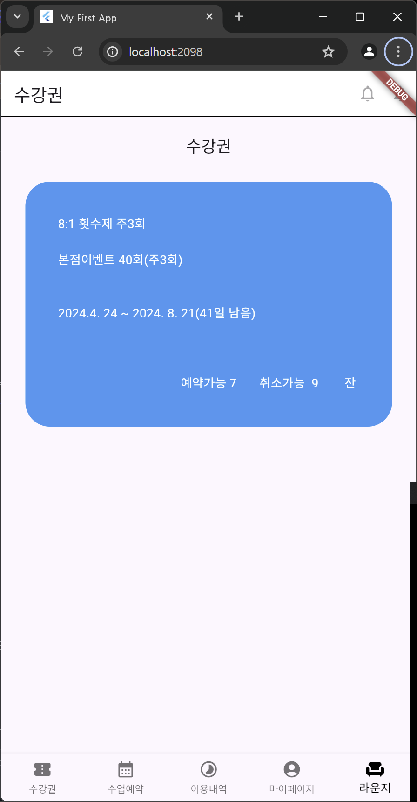
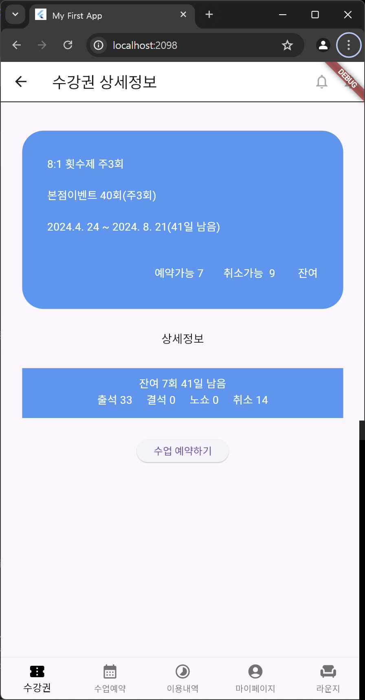
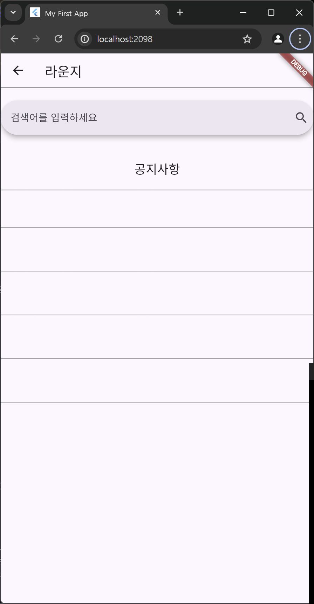

## AIFFEL Campus Online Code Peer Review Templete
- 코더 : 김소영
- 리뷰어 : 김주현


## PRT(Peer Review Template)

- [O]  **1. 주어진 문제를 해결하는 완성된 코드가 제출되었나요?**
    - 문제에서 요구하는 최종 결과물이 첨부되었는지 확인
    - 문제를 해결하는 완성된 코드란 프로젝트 루브릭 3개 중 2개, 퀘스트 문제 요구조건 등을 지칭
        - 네. 모든 요구사항을 잘 충족하였습니다. <br>
  
        
- [O]  **2. 전체 코드에서 가장 핵심적이거나 가장 복잡하고 이해하기 어려운 부분에 작성된 
주석 또는 doc string을 보고 해당 코드가 잘 이해되었나요?**
    - 해당 코드 블럭에 doc string/annotation이 달려 있는지 확인
    - 해당 코드가 무슨 기능을 하는지, 왜 그렇게 짜여진건지, 작동 메커니즘이 뭔지 기술.
    - 주석을 보고 코드 이해가 잘 되었는지 확인
```Dart
      body: Column(
        mainAxisAlignment: MainAxisAlignment.start,
        children: [
          Container(
            height: 1.0,
            width: double.infinity,
            color: Colors.black,
          ),
          const SizedBox(height: 20), // AppBar와 Text 사이의 여백
          
          const Text(
            '수강권',
            style: TextStyle(fontSize: 20),
          ),
          GestureDetector(
            onTap: () {
              Navigator.push(
                context,
                MaterialPageRoute(builder: (context) => const DetailPage()),
              ); // 수강권 containerbox 눌렀을 때 
            },
            child: Container(
              width: 650,
              height: 300,
              padding: const EdgeInsets.all(40), // 패딩 속성
              margin: const EdgeInsets.all(30), // 마진 속성
              decoration: const BoxDecoration(
                color: Colors.blue, // 컨테이너의 background color
                borderRadius: BorderRadius.all(
                  Radius.circular(30),
                ), // 컨테이너의 border 모양
              ),
              child: const Text(
                "8:1 횟수제 주3회\n\n본점이벤트 40회(주3회)\n\n\n2024.4. 24 ~ 2024. 8. 21(41일 남음)\n\n\n\n                                      예약가능 7       취소가능  9        잔여  7/40",
                style: TextStyle(fontSize: 15, color: Colors.white),
              ),
            ),
          ),
        ],
      ),
```
```Dart
      bottomNavigationBar: BottomNavigationBar(
        type: BottomNavigationBarType.fixed,
        currentIndex: screenIndex,
        items: const [
          BottomNavigationBarItem(icon: Icon(Icons.confirmation_number), label: '수강권'),
          BottomNavigationBarItem(icon: Icon(Icons.calendar_month), label: '수업예약'),
          BottomNavigationBarItem(icon: Icon(Icons.timelapse), label: '이용내역'),
          BottomNavigationBarItem(icon: Icon(Icons.account_circle), label: '마이페이지'),
          BottomNavigationBarItem(icon: Icon(Icons.chair), label: '라운지'),
        ],
        selectedItemColor: Colors.black,
        unselectedItemColor: Colors.black54,
        onTap: (value) {
          setState(() {
            screenIndex = value;
          });

          if (value == 4) { //라운지 탭 눌렀을 때 
            Navigator.push(
              context,
              MaterialPageRoute(builder: (context) => const BoardPage()),
            );
          }
        },
      ),
```
        
- ['X']  **3. 에러가 난 부분을 디버깅하여 문제를 “해결한 기록을 남겼거나” 
”새로운 시도 또는 추가 실험을 수행”해봤나요?**
    - 문제 원인 및 해결 과정을 잘 기록하였는지 확인 또는
    - 문제에서 요구하는 조건에 더해 추가적으로 수행한 나만의 시도, 
    실험이 기록되어 있는지 확인
        - 분명 새로운 시도나 디버깅을 통한 문제 해결이 있었을 것으로 생각되나, 기록으로 잘 남겨있지는 않아서 아쉬웠습니다. 
        
- [O]  **4. 회고를 잘 작성했나요?**
    - 주어진 문제를 해결하는 완성된 코드 내지 프로젝트 결과물에 대해 배운점과 아쉬운점, 느낀점 등이 상세히 기록되어 있는지 확인
        - 피어 리뷰 시간을 통해 문제에 봉착했던 상황, 향후 해결 방식 등에 대해 청취할 수 있었습니다. 

- [O]  **5. 코드가 간결하고 효율적인가요?**
    - 코드 중복을 최소화하고 범용적으로 사용할 수 있도록 모듈화(함수화) 했는지
        - 네. 군더더기 없이 깔끔하게 전체 코드가 작성되었습니다. 


## 참고 링크 및 코드 개선
```
# 코드 리뷰 시 참고한 링크가 있다면 링크와 간략한 설명을 첨부합니다.
# 코드 리뷰를 통해 개선한 코드가 있다면 코드와 간략한 설명을 첨부합니다.
```
